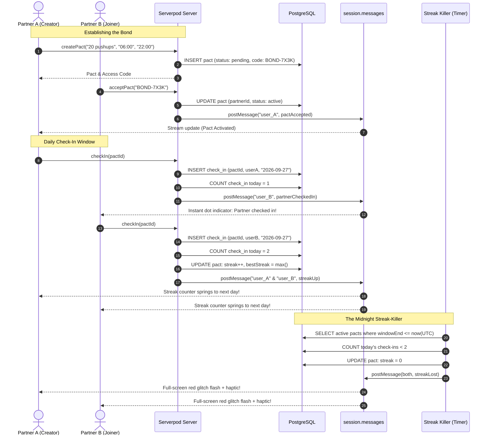

# STREAKBOND ⚡

> **"Duolingo streaks, but your friend's laziness can kill yours."**

StreakBond is a two-person accountability pact app built for the **"Build Something Real: The Serverpod Hackathon"** (deadline: 14 Oct 2026).

---

## 🎯 The Core Concept

Accountability apps fail because the cost of failing only hurts yourself. StreakBond changes the stakes:
- Two users enter into **ONE** shared daily commitment (e.g. *"20 pushups"*, *"Study 30 min"*, *"No sugar"*).
- Both members must check in inside the agreed daily window.
- If **EITHER** person misses, **BOTH** streaks burn to zero.
- Your partner's discipline protects your streak, and yours protects theirs.

---

## 🛠️ Tech Stack (100% Free & Open Source)

- **Frontend**: Flutter 3.47+ (Targets: Web, Android, iOS, Desktop)
  - Custom *Neo-cyber premium* dark HUD design system
  - Space Grotesk display typography + Inter body typography
  - Glassmorphism surfaces (`BackdropFilter` + neon borders)
  - Full-screen glitch shake overlay on streak death with haptics
  - Circular animated countdown ring tracking window closure
- **Backend**: Serverpod 4.0.3 + PostgreSQL
  - Server-side streak integrity engine (impossible for clients to spoof streaks)
  - `PactEndpoint`: Atomic idempotent check-ins & mutual verification
  - `StreakStreamEndpoint`: Real-time WebSocket event streaming (`session.messages`)
  - Serverpod Auth IDP module (Email + JWT token authentication)
  - **Scheduled Streak-Killer**: Background task evaluating pact deadlines and executing streak resets

---

## 📐 Architecture & Real-Time Flow



---

## 📱 The 4 Screens

1. **Pact List Screen**: Live dashboard showing all active/pending pacts, streak count, status badges, and quick-add actions.
2. **Create / Join Screen**: 
   - *New Pact*: Define daily commitment title, custom daily check-in window (start/end in UTC). Generates copyable access keys (e.g. `BOND-7X3K`).
   - *Join Pact*: Input access key to bond with your partner.
3. **Pact Detail Screen (Hero)**:
   - Giant glowing streak hero counter with spring physics
   - Best streak record badge
   - Dual presence status matrix (`YOU` vs `PARTNER`)
   - Animated circular countdown ring showing time remaining today
   - Primary `CHECK IN` action button with neon pulsation
   - Real-time instant updates when partner logs discipline
   - Dramatic red glitch flash overlay if streak is reset
4. **History Heatmap Screen**:
   - 35-day (5-week) GitHub-style contribution matrix
   - Color coded: Green (Both checked in 2/2), Yellow (Solo check-in 1/2), Dark (Missed 0/2)
   - Lifetime statistics: Total check-ins and Perfect days

---

## ⚡ How the Scheduled Streak-Killer Works

The showcase feature is the **Midnight Streak-Killer** (`StreakEvaluator`).
1. Evaluates all active pacts whose `checkInWindowEndUtc` has elapsed.
2. Checks the database for today's check-in count for that pact.
3. If `count < 2` (one or both members failed to check in):
   - Sets `pact.streak = 0`.
   - Logs the incident to the Serverpod server log with warning severity.
   - Broadcasts a real-time `streakLost` `PactEvent` to both users via `session.messages`.
4. Connected client screens immediately shake and flash with a red glitch animation.

### 🧪 Demo Mode (Fast-Forward)

To demonstrate the streak-killer without waiting until midnight:
```bash
# In Serverpod server:
$env:STREAKBOND_DEMO_MODE="true"   # Windows PowerShell
export STREAKBOND_DEMO_MODE=true    # Linux / macOS
dart bin/main.dart
```
In demo mode:
- The evaluator runs every **30 seconds** (instead of standard minute scans).
- Logs `[DEMO MODE] Streak evaluator running every 30 seconds`.

---

## 🚀 Running Locally

### Prerequisites
- [Flutter SDK](https://flutter.dev) (v3.22+)
- [Dart SDK](https://dart.dev) (v3.4+)
- [Serverpod CLI](https://serverpod.dev) (`dart pub global activate serverpod_cli`)
- [Docker](https://www.docker.com) (for PostgreSQL database)

### 1. Start the Database
```bash
cd streakbond/streakbond_server
docker compose up -d
```

### 2. Run Database Migrations
```bash
serverpod generate
serverpod create-migration
dart bin/main.dart --apply-migrations
```

### 3. Start the Server
```bash
dart bin/main.dart
```
The Serverpod backend will be listening on `http://localhost:8080` (API) and `http://localhost:8081` (Insights).

### 4. Run the Flutter App
In another terminal:
```bash
cd streakbond/streakbond_flutter
flutter run -d chrome     # Run on Web
# or
flutter run -d emulator-5554  # Run on Android
```

---

## 🎥 Demo Video Script (Under 3 Minutes)

- **0:00 - 0:20 | The Problem**: "Streaks on fitness apps are easy to abandon when you're tired. But what if your laziness killed your best friend's streak too? Welcome to StreakBond."
- **0:20 - 1:30 | Pact Creation & Dual Check-In**:
  - Show User A creating a pact: "20 Pushups" with a daily check-in window.
  - User A gets access key `BOND-7X3K`.
  - User B (second window / phone) enters `BOND-7X3K` and locks in.
  - User A's screen updates in real-time via WebSocket.
  - User A checks in -> User B's screen instantly shows partner checked in.
  - User B checks in -> Both screens spring-animate the giant streak counter up to Day 1!
- **1:30 - 2:20 | The Midnight Streak-Killer**:
  - Fast-forward check-in window close via demo mode.
  - One user deliberately does not check in.
  - The background streak-killer evaluates the pact: Streak killed!
  - Both screens shake with full-screen hot red glitch flash and reset to 0!
- **2:20 - 3:00 | Heatmap & Pitch Close**:
  - Walk through the 35-day accountability heatmap.
  - Close with: "Serverpod + Flutter. Pure discipline. StreakBond."
