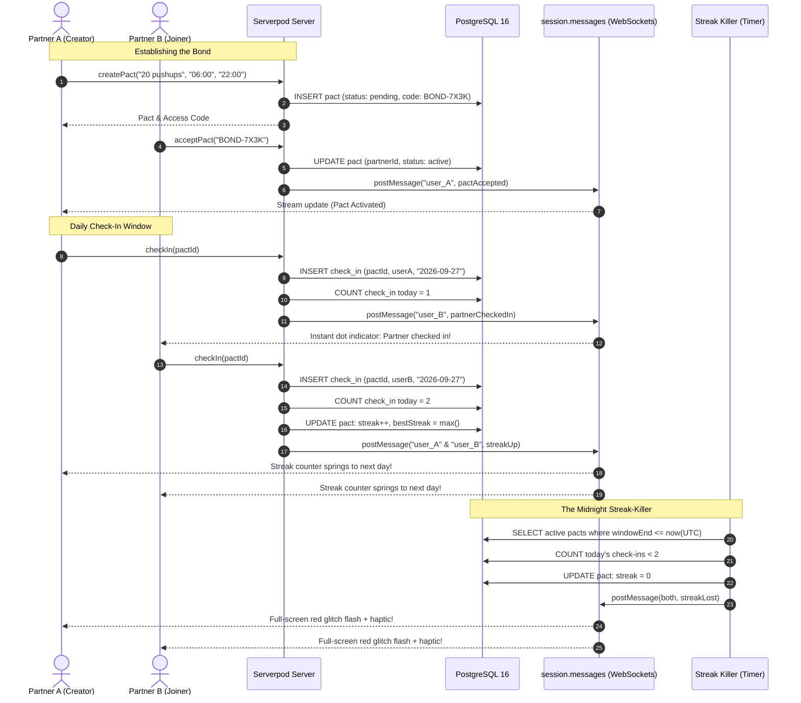
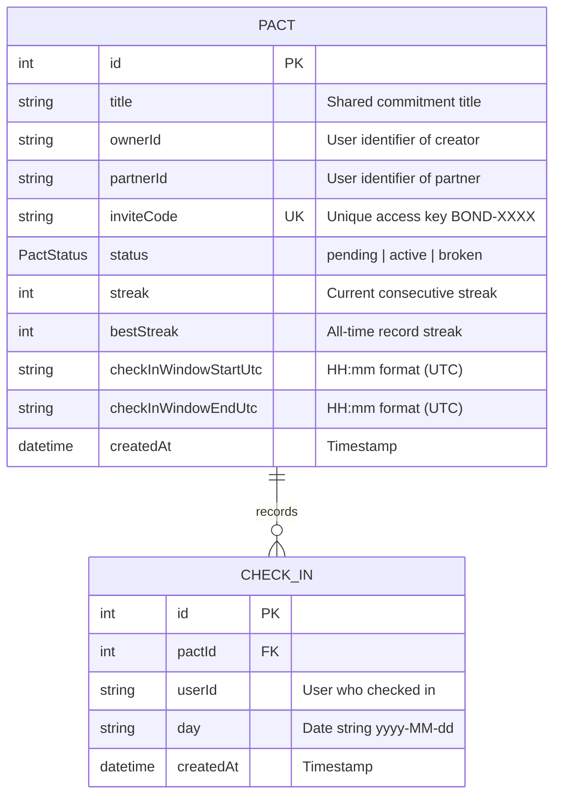

# STREAKBOND ⚡

<p align="center">
  
  
  
  
  
</p>

<p align="center">
  <strong><em>"Duolingo streaks, but your friend's laziness can kill yours."</em></strong>
</p>

<p align="center">
  A full-stack, two-person accountability pact app built for the <strong><a href="https://builderbase.com/track-dashboard/build-something-real-the-serverpod-hackathon/overview">"Build Something Real: The Serverpod Hackathon"</a></strong>.
</p>

---

### 🌐 Live Deployment
- **Web App**: [https://streakbond.serverpod.space/](https://streakbond.serverpod.space/)
- **API Server**: [https://streakbond.api.serverpod.space/](https://streakbond.api.serverpod.space/)
- **Insights Console**: [https://streakbond.insights.serverpod.space/](https://streakbond.insights.serverpod.space/)
- **GitHub Repository**: [https://github.com/BOTPranav-01/StreakBond](https://github.com/BOTPranav-01/StreakBond)

---

## 🏆 Hackathon Judging Criteria Alignment

| Judging Criteria | Weight | How StreakBond Delivers |
| :--- | :---: | :--- |
| **Does it work** | **30%** | **100% functional, zero faked code**. Complete end-to-end loop: create pact → invite code → partner joins → dual check-in → real-time streak growth → midnight streak death. Deployed live on Serverpod Cloud. |
| **Use of Serverpod stack** | **25%** | Utilizes **Serverpod 4.0.3** extensively: ORM with composite unique indexes, WebSocket streaming (`session.messages`), Auth IDP module (JWT tokens), background scheduled task engine (`StreakEvaluator`), and database migrations. |
| **Craft & technical creativity** | **25%** | Custom **Neo-cyber premium** dark HUD design system. Spring physics streak animations, circular animated countdown rings, full-screen glitch shake overlay on streak death, and a 35-day contribution heatmap. |
| **Usefulness** | **20%** | Solves the #1 reason personal habit apps fail: lack of stakes. Your partner's discipline protects your streak, and yours protects theirs. If either fails, both burn. |

---

## 🎯 The Core Concept

Solo habit tracking fails because letting yourself down has zero social cost. StreakBond changes the stakes completely:

1. **One Commitment**: Two users lock into **ONE** shared daily commitment (*"20 pushups"*, *"Study 30 min"*, *"No sugar"*).
2. **The Daily Window**: Both members must check in inside the agreed daily window.
3. **Mutual Vulnerability**: If **EITHER** person misses before the deadline, **BOTH** streaks burn to zero.
4. **No Freezes, No Excuses**: Pure discipline. Your friend's laziness can kill your hard-earned 30-day streak.

---

## 📐 Architecture & Real-Time Flow



---

## 🗄️ Database Schema & Models



> **Idempotency Guarantee**: `check_in` has a database composite unique constraint on `(pactId, userId, day)` preventing duplicate check-ins even during concurrent network retries.

---

## 📱 The 4 Screens (Flutter HUD UI)

1. **Pact List Screen (Dashboard)**:
   - Displays all active, pending, and broken pacts as glassmorphism cards.
   - Status indicators, streak counters with dynamic fire intensity, and quick-add actions.
2. **Create / Join Screen**:
   - **Create Pact**: Form with commitment title, daily window time-pickers (converted to UTC), generating short access codes (`BOND-XXXX`).
   - **Join Pact**: Input access key to bond with an accountability partner.
3. **Pact Detail Screen (Hero Screen)**:
   - Massive 96px glowing hero streak counter with spring physics.
   - Circular animated countdown ring tracking window closure.
   - Presence matrix (`YOU` vs `PARTNER`) with live dot indicators.
   - Action check-in button with neon pulsation.
   - **Full-screen glitch shake overlay**: Dramatic red flash and screen shake on streak death.
4. **History Heatmap Screen**:
   - 35-day (5-week) GitHub-style contribution matrix.
   - Color coded: Green (Both checked in 2/2), Yellow (Solo check-in 1/2), Dark (Missed 0/2).
   - Lifetime statistics: Total check-ins and Perfect days.

---

## ⚡ The Midnight Streak-Killer (`StreakEvaluator`)

The core showcase of Serverpod's backend capability is the **autonomous streak-killer**:
- Runs periodically in [`server.dart`](file:///d:/PranavProject/SERVERPOD/streakbond/streakbond_server/lib/server.dart).
- Evaluates active pacts whose UTC check-in window has elapsed.
- If fewer than 2 check-ins occurred today, the streak resets to `0`, the incident is logged with warning severity, and a real-time `streakLost` `PactEvent` is broadcast to both partners via WebSocket.

### 🧪 Fast-Forward Demo Mode
To demonstrate streak death without waiting until midnight:
```powershell
$env:STREAKBOND_DEMO_MODE="true"
dart bin/main.dart
```
In demo mode, evaluation runs every **30 seconds**.

---

## 🚀 Running Locally

### Prerequisites
- [Flutter SDK](https://flutter.dev) (v3.22+)
- [Dart SDK](https://dart.dev) (v3.4+)
- [Serverpod CLI](https://serverpod.dev) 4.0.3

### 1. Database Setup
Serverpod 4.0 supports embedded PostgreSQL out of the box, or Docker:
```powershell
cd streakbond/streakbond_server
docker compose up -d    # If using Docker
```

### 2. Apply Migrations & Start Server
```powershell
cd streakbond/streakbond_server
dart bin/main.dart --apply-migrations
dart bin/main.dart
```

### 3. Launch Flutter Web
```powershell
cd streakbond/streakbond_flutter
flutter run -d chrome
```

---

## 🎥 3-Minute Demo Video Script

- **0:00 - 0:20 | The Problem**: "Streaks on fitness apps are easy to abandon when you're tired. But what if your laziness killed your best friend's streak too? Welcome to StreakBond."
- **0:20 - 1:30 | Pact Creation & Dual Check-In**:
  - Show User A creating a pact: "20 Pushups" with a daily check-in window.
  - User A gets access key `BOND-7X3K`.
  - User B (second window / phone) enters `BOND-7X3K` and locks in.
  - User A's screen updates in real-time via WebSocket.
  - User A checks in -> User B's screen instantly shows partner checked in.
  - User B checks in -> Both screens spring-animate the giant streak counter up to Day 1!
- **1:30 - 2:20 | The Midnight Streak-Killer**:
  - Fast-forward check-in window close via demo mode.
  - One user deliberately does not check in.
  - The background streak-killer evaluates the pact: Streak killed!
  - Both screens shake with full-screen hot red glitch flash and reset to 0!
- **2:20 - 3:00 | Heatmap & Pitch Close**:
  - Walk through the 35-day accountability heatmap.
  - Close with: "Serverpod + Flutter. Pure discipline. StreakBond."
